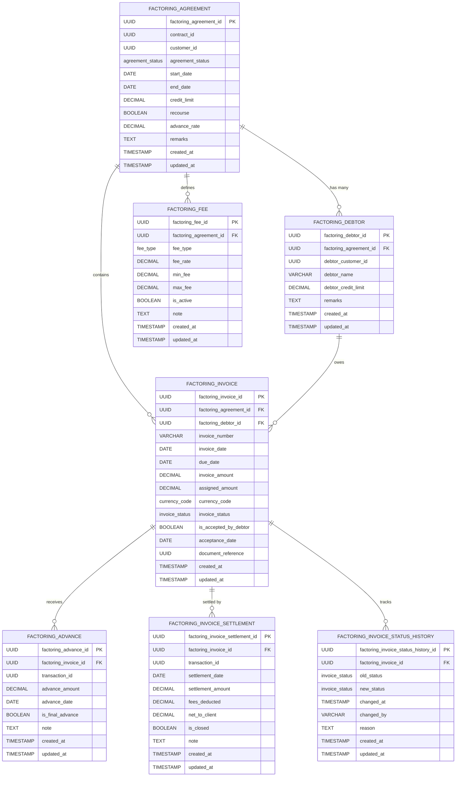

# Core Lending Factoring Microservice

[](https://opensource.org/licenses/Apache-2.0)
[](https://openjdk.java.net/projects/jdk/21/)
[](https://spring.io/projects/spring-boot)

## Overview

The **Core Lending Factoring Microservice** is a critical component of the **Firefly OpenCore Banking Platform**, developed by **Firefly Software Solutions Inc** under the Apache 2.0 license. This microservice provides comprehensive factoring services for financial institutions, enabling them to offer invoice factoring solutions to their business customers.

**Factoring** is a financial transaction where a business sells its accounts receivable (invoices) to a third party (the factor) at a discount, providing immediate cash flow while transferring the collection risk.

This microservice manages the complete factoring lifecycle including:
- Factoring agreement management
- Debtor registration and credit management
- Invoice assignment and processing
- Advance payments to clients
- Settlement processing when debtors pay
- Fee calculation and management
- Comprehensive audit trails

## About Firefly OpenCore Banking Platform

- **Organization**: [Firefly Software Solutions Inc](https://getfirefly.io)
- **GitHub Organization**: [firefly-oss](https://github.com/firefly-oss)
- **License**: Apache 2.0
- **Platform**: Modern, cloud-native banking platform built for scalability and compliance

## Architecture

The microservice follows a **clean architecture** pattern with clear separation of concerns across multiple modules:

### Module Structure

```
core-lending-factoring/
├── core-lending-factoring-interfaces/    # API contracts and DTOs
├── core-lending-factoring-models/        # Data entities and repositories
├── core-lending-factoring-core/          # Business logic implementation
├── core-lending-factoring-web/           # REST API controllers
└── core-lending-factoring-sdk/           # Client SDK and OpenAPI specs
```

#### 1. **core-lending-factoring-interfaces**
- **Purpose**: API contracts and data transfer objects
- **Contains**: DTOs, service interfaces, enums, validation annotations
- **Dependencies**: Validation libraries, common utilities

#### 2. **core-lending-factoring-models**
- **Purpose**: Data persistence layer
- **Contains**: JPA entities, R2DBC repositories, database migrations
- **Dependencies**: Spring Data R2DBC, PostgreSQL drivers, Flyway

#### 3. **core-lending-factoring-core**
- **Purpose**: Business logic implementation
- **Contains**: Service implementations, domain logic, data mapping
- **Dependencies**: Interfaces module, Models module, MapStruct

#### 4. **core-lending-factoring-web**
- **Purpose**: HTTP API layer
- **Contains**: REST controllers, configuration, main application class
- **Dependencies**: Spring WebFlux, OpenAPI, Actuator

#### 5. **core-lending-factoring-sdk**
- **Purpose**: Client integration support
- **Contains**: OpenAPI specifications, generated client code
- **Dependencies**: OpenAPI tools

## Technology Stack

### Core Technologies
- **Java 21** with Virtual Threads for enhanced concurrency
- **Spring Boot 3.x** for application framework
- **Spring WebFlux** for reactive, non-blocking web layer
- **Spring Data R2DBC** for reactive database access
- **PostgreSQL** as the primary database
- **Flyway** for database schema migrations

### Additional Technologies
- **MapStruct** for efficient object mapping
- **Lombok** for reducing boilerplate code
- **SpringDoc OpenAPI** for API documentation
- **Micrometer** with Prometheus for metrics
- **Maven** for dependency management and builds
- **Docker** for containerization

### Validation & Quality
- **Jakarta Validation** for input validation
- **Custom validators** from `lib-commons-validators`
- **JUnit 5** for testing
- **Reactor Test** for reactive testing

## Key Features

### Factoring Agreement Management
- Create and manage factoring agreements with clients
- Configure credit limits, advance rates, and terms
- Support for both recourse and non-recourse factoring
- Agreement status tracking (Active, Suspended, Closed, Terminated)

### Debtor Management
- Register and manage debtors within factoring agreements
- Set individual debtor credit limits
- Track debtor payment history and creditworthiness

### Invoice Processing
- Assign invoices to factoring agreements
- Support multiple currencies (EUR, USD, GBP, CHF)
- Track invoice status throughout lifecycle
- Maintain comprehensive status history

### Advance Management
- Calculate and process advance payments to clients
- Support multiple advances per invoice
- Track advance amounts and dates
- Final advance processing capabilities

### Settlement Processing
- Process debtor payments against invoices
- Calculate fees and net amounts to clients
- Support partial and full settlements
- Automatic invoice closure upon full payment

### Fee Management
- Configure multiple fee types (Discount, Admin, Collection, Service, Late)
- Flexible fee calculation with rates, minimums, and maximums
- Fee tracking and reporting

### Audit & Compliance
- Complete audit trails for all transactions
- Status change history tracking
- Comprehensive logging and monitoring
- Regulatory compliance support

## Database Schema

The microservice uses **PostgreSQL** with a well-designed relational schema optimized for factoring operations. All entities use **UUID** primary keys for enhanced security and distributed system compatibility.

### Entity Relationship Diagram



### Enumerations

#### Agreement Status
- `ACTIVE` - Agreement is active and operational
- `CLOSED` - Agreement has been closed normally
- `SUSPENDED` - Agreement is temporarily suspended
- `TERMINATED` - Agreement has been terminated

#### Invoice Status
- `ASSIGNED` - Invoice has been assigned to factoring
- `PAID` - Invoice has been paid by debtor
- `CLOSED` - Invoice processing is complete
- `DEFAULT` - Invoice is in default
- `DISPUTED` - Invoice is disputed
- `CANCELLED` - Invoice has been cancelled

#### Currency Codes
- `EUR` - Euro
- `USD` - US Dollar
- `GBP` - British Pound
- `CHF` - Swiss Franc

#### Fee Types
- `DISCOUNT_FEE` - Primary factoring discount fee
- `ADMIN_FEE` - Administrative processing fee
- `COLLECTION_FEE` - Debt collection fee
- `SERVICE_FEE` - General service fee
- `LATE_FEE` - Late payment penalty fee

## Getting Started

### Prerequisites

- **Java 21** or higher
- **Maven 3.8+** for dependency management
- **PostgreSQL 13+** database server
- **Docker** (optional, for containerized deployment)

### Environment Variables

Configure the following environment variables for database connectivity:

| Variable | Description | Example |
|----------|-------------|---------|
| `DB_HOST` | PostgreSQL database host | `localhost` |
| `DB_PORT` | PostgreSQL database port | `5432` |
| `DB_NAME` | PostgreSQL database name | `factoring_db` |
| `DB_USERNAME` | PostgreSQL username | `factoring_user` |
| `DB_PASSWORD` | PostgreSQL password | `secure_password` |
| `DB_SSL_MODE` | PostgreSQL SSL mode | `disable` or `require` |
| `SERVER_ADDRESS` | Server bind address | `localhost` |
| `SERVER_PORT` | Server port | `8080` |

### Quick Start

1. **Clone the repository**
   ```bash
   git clone https://github.com/firefly-oss/core-lending-factoring.git
   cd core-lending-factoring
   ```

2. **Set up PostgreSQL database**
   ```sql
   CREATE DATABASE factoring_db;
   CREATE USER factoring_user WITH PASSWORD 'secure_password';
   GRANT ALL PRIVILEGES ON DATABASE factoring_db TO factoring_user;
   ```

3. **Set environment variables**
   ```bash
   export DB_HOST=localhost
   export DB_PORT=5432
   export DB_NAME=factoring_db
   export DB_USERNAME=factoring_user
   export DB_PASSWORD=secure_password
   export DB_SSL_MODE=disable
   ```

4. **Build and run the application**
   ```bash
   mvn clean package
   mvn spring-boot:run -pl core-lending-factoring-web
   ```

5. **Verify the application**
   - Health check: http://localhost:8080/actuator/health
   - API documentation: http://localhost:8080/swagger-ui.html

### Docker Deployment

1. **Build Docker image**
   ```bash
   docker build -t firefly/core-lending-factoring:latest .
   ```

2. **Run with Docker Compose**
   ```yaml
   version: '3.8'
   services:
     factoring-service:
       image: firefly/core-lending-factoring:latest
       ports:
         - "8080:8080"
       environment:
         - DB_HOST=postgres
         - DB_PORT=5432
         - DB_NAME=factoring_db
         - DB_USERNAME=factoring_user
         - DB_PASSWORD=secure_password
         - DB_SSL_MODE=disable
       depends_on:
         - postgres

     postgres:
       image: postgres:15
       environment:
         - POSTGRES_DB=factoring_db
         - POSTGRES_USER=factoring_user
         - POSTGRES_PASSWORD=secure_password
       volumes:
         - postgres_data:/var/lib/postgresql/data

   volumes:
     postgres_data:
   ```

## Configuration

The application supports multiple Spring profiles for different environments:

### Available Profiles

- **`dev`** - Development environment with detailed logging and debugging
- **`testing`** - Testing environment with API documentation enabled
- **`prod`** - Production environment with optimized logging and security

### Configuration Files

Primary configuration is in `core-lending-factoring-web/src/main/resources/application.yaml`:

```yaml
spring:
  application:
    name: core-lending-factoring
    version: 1.0.0
    description: Factoring Core Application
    team:
      name: Firefly Software Solutions Inc
      email: dev@getfirefly.io

  r2dbc:
    pool:
      initial-size: 5
      max-size: 10
      max-idle-time: 30m
      validation-query: SELECT 1
    url: r2dbc:postgresql://${DB_HOST}:${DB_PORT}/${DB_NAME}?sslMode=${DB_SSL_MODE}
    username: ${DB_USERNAME}
    password: ${DB_PASSWORD}

  flyway:
    enabled: true
    baseline-on-migrate: true
    locations: classpath:db/migration

  threads:
    virtual:
      enabled: true

server:
  address: ${SERVER_ADDRESS:localhost}
  port: ${SERVER_PORT:8080}
  shutdown: graceful
```

## API Documentation

### OpenAPI Specification

The microservice provides comprehensive API documentation through OpenAPI 3.0 specification:

- **Swagger UI**: http://localhost:8080/swagger-ui.html
- **OpenAPI JSON**: http://localhost:8080/v3/api-docs
- **OpenAPI YAML**: http://localhost:8080/v3/api-docs.yaml

### API Endpoints

The REST API follows RESTful conventions with hierarchical resource structure:

#### Factoring Agreements
```
GET    /api/v1/factoring-agreements              # List agreements
POST   /api/v1/factoring-agreements              # Create agreement
GET    /api/v1/factoring-agreements/{id}         # Get agreement
PUT    /api/v1/factoring-agreements/{id}         # Update agreement
DELETE /api/v1/factoring-agreements/{id}         # Delete agreement
```

#### Debtors (within Factoring Agreement)
```
GET    /api/v1/factoring-agreements/{agreementId}/debtors              # List debtors
POST   /api/v1/factoring-agreements/{agreementId}/debtors              # Create debtor
GET    /api/v1/factoring-agreements/{agreementId}/debtors/{id}         # Get debtor
PUT    /api/v1/factoring-agreements/{agreementId}/debtors/{id}         # Update debtor
DELETE /api/v1/factoring-agreements/{agreementId}/debtors/{id}         # Delete debtor
```

#### Invoices (within Factoring Agreement)
```
GET    /api/v1/factoring-agreements/{agreementId}/invoices             # List invoices
POST   /api/v1/factoring-agreements/{agreementId}/invoices             # Create invoice
GET    /api/v1/factoring-agreements/{agreementId}/invoices/{id}        # Get invoice
PUT    /api/v1/factoring-agreements/{agreementId}/invoices/{id}        # Update invoice
DELETE /api/v1/factoring-agreements/{agreementId}/invoices/{id}        # Delete invoice
```

#### Advances (within Invoice)
```
GET    /api/v1/factoring-agreements/{agreementId}/invoices/{invoiceId}/advances        # List advances
POST   /api/v1/factoring-agreements/{agreementId}/invoices/{invoiceId}/advances        # Create advance
GET    /api/v1/factoring-agreements/{agreementId}/invoices/{invoiceId}/advances/{id}   # Get advance
PUT    /api/v1/factoring-agreements/{agreementId}/invoices/{invoiceId}/advances/{id}   # Update advance
DELETE /api/v1/factoring-agreements/{agreementId}/invoices/{invoiceId}/advances/{id}  # Delete advance
```

#### Settlements (within Invoice)
```
GET    /api/v1/factoring-agreements/{agreementId}/invoices/{invoiceId}/settlements        # List settlements
POST   /api/v1/factoring-agreements/{agreementId}/invoices/{invoiceId}/settlements        # Create settlement
GET    /api/v1/factoring-agreements/{agreementId}/invoices/{invoiceId}/settlements/{id}   # Get settlement
PUT    /api/v1/factoring-agreements/{agreementId}/invoices/{invoiceId}/settlements/{id}   # Update settlement
DELETE /api/v1/factoring-agreements/{agreementId}/invoices/{invoiceId}/settlements/{id}  # Delete settlement
```

#### Fees (within Factoring Agreement)
```
GET    /api/v1/factoring-agreements/{agreementId}/fees              # List fees
POST   /api/v1/factoring-agreements/{agreementId}/fees              # Create fee
GET    /api/v1/factoring-agreements/{agreementId}/fees/{id}         # Get fee
PUT    /api/v1/factoring-agreements/{agreementId}/fees/{id}         # Update fee
DELETE /api/v1/factoring-agreements/{agreementId}/fees/{id}         # Delete fee
```

#### Invoice Status History
```
GET    /api/v1/factoring-agreements/{agreementId}/invoices/{invoiceId}/status-history   # Get status history
```

### Request/Response Features

- **Pagination**: All list endpoints support pagination with `page`, `size`, and `sort` parameters
- **Filtering**: Advanced filtering capabilities using query parameters
- **Validation**: Comprehensive input validation with detailed error messages
- **Error Handling**: Standardized error responses with proper HTTP status codes
- **Content Negotiation**: Support for JSON content type
- **CORS**: Configurable CORS support for web applications

### Authentication & Authorization

The microservice integrates with the Firefly platform's authentication system:
- JWT token-based authentication
- Role-based access control (RBAC)
- Resource-level permissions
- Audit logging of all operations

## Development

### Development Setup

1. **IDE Configuration**
   - Enable annotation processing for Lombok and MapStruct
   - Configure code style according to project conventions
   - Install recommended plugins for Spring Boot development

2. **Local Development Database**
   ```bash
   # Start PostgreSQL with Docker
   docker run --name factoring-postgres \
     -e POSTGRES_DB=factoring_dev \
     -e POSTGRES_USER=dev_user \
     -e POSTGRES_PASSWORD=dev_password \
     -p 5432:5432 \
     -d postgres:15
   ```

3. **Running Tests**
   ```bash
   # Run all tests
   mvn test

   # Run specific test class
   mvn test -Dtest=FactoringAgreementServiceTest

   # Run integration tests
   mvn test -Dtest=*IT
   ```

### Code Organization

#### Adding New Features

Follow the established pattern when adding new functionality:

1. **Define DTOs** in `core-lending-factoring-interfaces`
   - Create request/response DTOs with proper validation annotations
   - Add filtering annotations for searchable fields
   - Include comprehensive JavaDoc documentation

2. **Create Entities** in `core-lending-factoring-models`
   - Define JPA entities with proper relationships
   - Create repository interfaces extending R2DBC repositories
   - Add database migration scripts

3. **Implement Services** in `core-lending-factoring-core`
   - Create service interfaces and implementations
   - Add MapStruct mappers for entity-DTO conversion
   - Implement business logic with proper error handling

4. **Expose APIs** in `core-lending-factoring-web`
   - Create REST controllers with OpenAPI annotations
   - Add proper validation and error handling
   - Include integration tests

### Database Migrations

Database schema changes are managed through Flyway migrations:

1. **Create Migration Script**
   ```bash
   # Location: core-lending-factoring-models/src/main/resources/db/migration/
   # Naming: V{version}__{description}.sql
   # Example: V5__Add_Invoice_Notes_Column.sql
   ```

2. **Migration Best Practices**
   - Always use incremental version numbers
   - Include rollback instructions in comments
   - Test migrations on development database first
   - Never modify existing migration files

3. **Migration Example**
   ```sql
   -- V5__Add_Invoice_Notes_Column.sql
   -- Add notes column to factoring_invoice table

   ALTER TABLE factoring_invoice
   ADD COLUMN notes TEXT;

   -- Rollback: ALTER TABLE factoring_invoice DROP COLUMN notes;
   ```

### Code Quality Standards

- **Test Coverage**: Maintain minimum 80% code coverage
- **Code Style**: Follow Google Java Style Guide
- **Documentation**: Comprehensive JavaDoc for public APIs
- **Validation**: Use `lib-commons-validators` for consistent validation
- **Error Handling**: Implement proper exception handling with meaningful messages
- **Logging**: Use structured logging with appropriate log levels

## Testing

### Test Strategy

The project implements a comprehensive testing strategy:

#### Unit Tests
- **Service Layer**: Test business logic in isolation
- **Repository Layer**: Test data access with @DataR2dbcTest
- **Mapper Tests**: Verify entity-DTO conversions
- **Validation Tests**: Test input validation rules

#### Integration Tests
- **API Tests**: End-to-end testing of REST endpoints
- **Database Tests**: Test with embedded PostgreSQL
- **Transaction Tests**: Verify transactional behavior

#### Test Execution

```bash
# Run all tests
mvn clean test

# Run tests with coverage report
mvn clean test jacoco:report

# Run only unit tests
mvn test -Dtest=*Test

# Run only integration tests
mvn test -Dtest=*IT

# Run specific test class
mvn test -Dtest=FactoringAgreementServiceTest

# Run tests in specific module
mvn test -pl core-lending-factoring-core
```

### Test Configuration

Test configuration uses Spring profiles and embedded databases:

```yaml
# application-test.yaml
spring:
  r2dbc:
    url: r2dbc:h2:mem:///testdb
  flyway:
    url: jdbc:h2:mem:testdb
```

## Monitoring & Observability

### Health Checks

The application exposes comprehensive health checks:

```bash
# Application health
curl http://localhost:8080/actuator/health

# Detailed health with components
curl http://localhost:8080/actuator/health/details

# Database connectivity
curl http://localhost:8080/actuator/health/db
```

### Metrics

Prometheus metrics are available for monitoring:

```bash
# All metrics
curl http://localhost:8080/actuator/prometheus

# Application info
curl http://localhost:8080/actuator/info

# JVM metrics
curl http://localhost:8080/actuator/metrics/jvm.memory.used
```

### Key Metrics

- **Business Metrics**: Invoice processing rates, settlement volumes
- **Technical Metrics**: Response times, error rates, database connections
- **JVM Metrics**: Memory usage, garbage collection, thread pools
- **Custom Metrics**: Factoring-specific KPIs and SLAs

### Logging

Structured logging with correlation IDs:

```json
{
  "timestamp": "2024-01-15T10:30:00.000Z",
  "level": "INFO",
  "logger": "com.firefly.core.lending.factoring.core.services",
  "message": "Invoice processed successfully",
  "correlationId": "abc-123-def",
  "factoringAgreementId": "550e8400-e29b-41d4-a716-446655440000",
  "invoiceId": "550e8400-e29b-41d4-a716-446655440001"
}
```

## Deployment

### Production Deployment

#### Kubernetes Deployment

```yaml
apiVersion: apps/v1
kind: Deployment
metadata:
  name: core-lending-factoring
spec:
  replicas: 3
  selector:
    matchLabels:
      app: core-lending-factoring
  template:
    metadata:
      labels:
        app: core-lending-factoring
    spec:
      containers:
      - name: factoring-service
        image: firefly/core-lending-factoring:1.0.0
        ports:
        - containerPort: 8080
        env:
        - name: DB_HOST
          value: "postgres-service"
        - name: DB_PORT
          value: "5432"
        - name: DB_NAME
          valueFrom:
            secretKeyRef:
              name: db-secret
              key: database
        - name: DB_USERNAME
          valueFrom:
            secretKeyRef:
              name: db-secret
              key: username
        - name: DB_PASSWORD
          valueFrom:
            secretKeyRef:
              name: db-secret
              key: password
        resources:
          requests:
            memory: "512Mi"
            cpu: "250m"
          limits:
            memory: "1Gi"
            cpu: "500m"
        livenessProbe:
          httpGet:
            path: /actuator/health
            port: 8080
          initialDelaySeconds: 30
          periodSeconds: 10
        readinessProbe:
          httpGet:
            path: /actuator/health/readiness
            port: 8080
          initialDelaySeconds: 5
          periodSeconds: 5
```

#### Service Configuration

```yaml
apiVersion: v1
kind: Service
metadata:
  name: core-lending-factoring-service
spec:
  selector:
    app: core-lending-factoring
  ports:
  - protocol: TCP
    port: 80
    targetPort: 8080
  type: ClusterIP
```

### Environment-Specific Configurations

#### Development
- Detailed logging enabled
- API documentation accessible
- Database migrations auto-applied
- CORS enabled for local development

#### Staging
- Production-like configuration
- Limited API documentation
- Manual migration approval
- Enhanced monitoring

#### Production
- Optimized logging levels
- API documentation disabled
- Strict security policies
- Full monitoring and alerting

## Contributing

### Development Workflow

1. **Fork the repository** from [firefly-oss/core-lending-factoring](https://github.com/firefly-oss/core-lending-factoring)

2. **Create feature branch**
   ```bash
   git checkout -b feature/your-feature-name
   ```

3. **Make changes following coding standards**
   - Write comprehensive tests
   - Update documentation
   - Follow commit message conventions

4. **Run quality checks**
   ```bash
   mvn clean verify
   mvn test
   ```

5. **Submit pull request**
   - Provide clear description of changes
   - Reference related issues
   - Ensure all checks pass

### Coding Standards

- **Java Style**: Follow Google Java Style Guide
- **Commit Messages**: Use conventional commit format
- **Documentation**: Update README and JavaDoc
- **Testing**: Maintain test coverage above 80%
- **Security**: Follow OWASP security guidelines

### Issue Reporting

When reporting issues, please include:
- Clear description of the problem
- Steps to reproduce
- Expected vs actual behavior
- Environment details (Java version, OS, etc.)
- Relevant log excerpts

## License

This project is licensed under the **Apache License 2.0** - see the [LICENSE](LICENSE) file for details.

```
Copyright 2024 Firefly Software Solutions Inc

Licensed under the Apache License, Version 2.0 (the "License");
you may not use this file except in compliance with the License.
You may obtain a copy of the License at

    http://www.apache.org/licenses/LICENSE-2.0

Unless required by applicable law or agreed to in writing, software
distributed under the License is distributed on an "AS IS" BASIS,
WITHOUT WARRANTIES OR CONDITIONS OF ANY KIND, either express or implied.
See the License for the specific language governing permissions and
limitations under the License.
```

## Support

- **Documentation**: [Firefly OpenCore Documentation](https://getfirefly.io/docs)
- **Community**: [GitHub Discussions](https://github.com/firefly-oss/core-lending-factoring/discussions)
- **Issues**: [GitHub Issues](https://github.com/firefly-oss/core-lending-factoring/issues)
- **Commercial Support**: [Contact Firefly](https://getfirefly.io/contact)

---

**Firefly OpenCore Banking Platform** - Building the future of banking technology.

For more information, visit [getfirefly.io](https://getfirefly.io) or explore our [GitHub organization](https://github.com/firefly-oss).